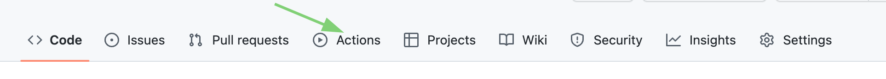
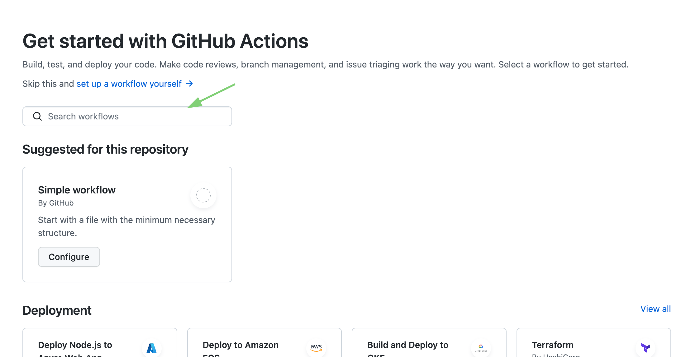
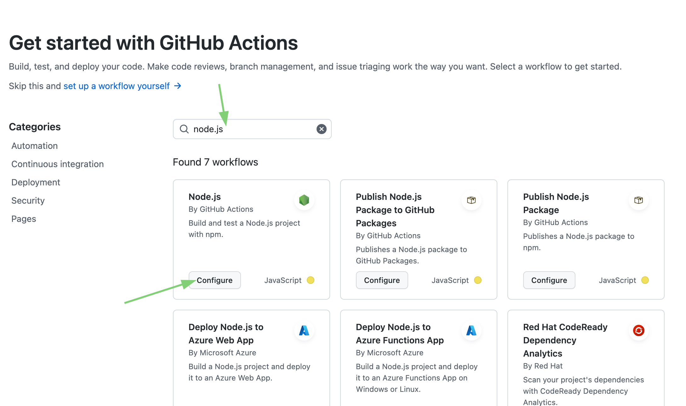
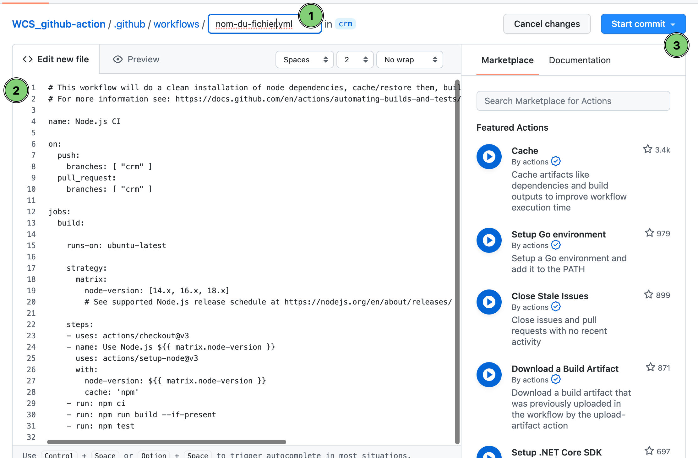
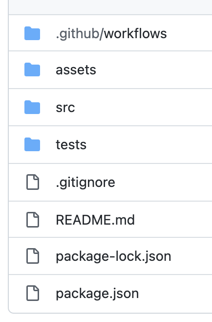

# Les github-actions

Les github-actions sont des scripts qui permettent d'automatiser des tâches sur github.

## Les actions

Les actions sont des scripts qui sont exécutés sur le serveur de github. Il y a plusieurs types d'actions :

-   les actions de github : elles sont écrites par github et sont disponibles pour tous les utilisateurs de github
-   les actions de la communauté : elles sont écrites par la communauté et sont disponibles pour tous les utilisateurs de github
-   les actions privées : elles sont écrites par une entreprise et sont disponibles pour les utilisateurs de github de cette entreprise





## Les workflows

Les workflows sont des séquences d'actions. Ils sont définis dans un fichier `.yml` qui se trouve dans le dossier `.github/workflows` en racine du répos. Il est possible de définir plusieurs workflows dans un même fichier.

## Les événements

Les workflows sont déclenchés par des événements. Il y a plusieurs types d'événements :

-   les événements de github : ils sont déclenchés par github
-   les événements de la communauté : ils sont déclenchés par la communauté
-   les événements privés : ils sont déclenchés par une entreprise

## Les jobs

Les jobs sont des séquences d'étapes. Ils sont définis dans un workflow. Il est possible de définir plusieurs jobs dans un même workflow.

## Les étapes

Les étapes sont des actions. Elles sont définies dans un job. Il est possible de définir plusieurs étapes dans un même job.



## Détailler un workflow

Voici un exemple de workflow qui permet de déployer une application sur un serveur distant :

> **Note**
>
> Le fichier ci-dessous est le fichier par défaut généré par github lorsqu'on créer une action de déploiement sur un serveur distant.

```yml
# This workflow will do a clean installation of node dependencies, cache/restore them, build the source code and run tests across different versions of node
# For more information see: https://docs.github.com/en/actions/automating-builds-and-tests/building-and-testing-nodejs

name: Node.js CI

on:
    push:
        branches: ["crm"]
    pull_request:
        branches: ["crm"]

jobs:
    build:
        runs-on: ubuntu-latest

        strategy:
            matrix:
                node-version: [14.x, 16.x, 18.x]
                # See supported Node.js release schedule at https://nodejs.org/en/about/releases/

        steps:
            - uses: actions/checkout@v3
            - name: Use Node.js ${{ matrix.node-version }}
              uses: actions/setup-node@v3
              with:
                  node-version: ${{ matrix.node-version }}
                  cache: "npm"
            - run: npm ci
            - run: npm run build --if-present
            - run: npm test
```

```yml
# Nom de l'action
name: Validation W3C

# Événements qui déclenchent l'action
on:
    push:
        branches: [crm, develop]
    pull_request:
        branches: [crm, develop]

# Jobs définissent les étapes de l'action
jobs:
    validation_w3c:
        runs-on: ubuntu-latest

        # Matrice de versions Node.js
        # pour exécuter l'action sur plusieurs versions
        # ⚠️ cette stratégie n'est pas nécessaire ici, c'est juste un exemple
        strategy:
            matrix:
                node-version: [16.x, 18.x]

        # Étapes de l'action
        steps:
            # Checkout du dépôt sur lequel l'action est déclenchée
            - name: Checkout
              uses: actions/checkout@v3

            # Installation de Node.js
            - name: Setup Node.js
              uses: actions/setup-node@v3
              with:
                  node-version: ${{ matrix.node-version }}

            # Installation des dépendances
            - name: Install Dependencies
              run: npm install

            # Validation du HTML
            - name: Validate HTML
              id: validate
              run: npm run test
```

## Options

Voici les options disponibles pour un workflow :

-   `name` : nom du workflow
-   `on` : événements qui déclenchent le workflow
-   `jobs` : jobs du workflow
-   `runs-on` : système d'exploitation sur lequel le job est exécuté
-   `steps` : étapes du job

Github nous met à disposition des variables :

-   `${{ github.actor }}` : nom de l'utilisateur qui a déclenché l'événement
-   `${{ github.repository }}` : nom du dépôt
-   `${{ github.repository_owner }}` : nom du propriétaire du dépôt
-   `${{ github.sha }}` : identifiant du commit
-   `${{ github.ref }}` : nom de la branche
-   `${{ github.event_name }}` : nom de l'événement

## Les secrets

Les secrets sont des variables qui sont stockées sur le serveur de github. Il est possible de les utiliser dans les workflows.

Pour créer un secret, il faut aller dans les paramètres du dépôt, puis dans l'onglet `Secrets`.

## Et voilà !

Vous êtes actuellement sur le repo qui contient le code de ce cours.
Vous pouvez retrouver toutes les informations :smile:


